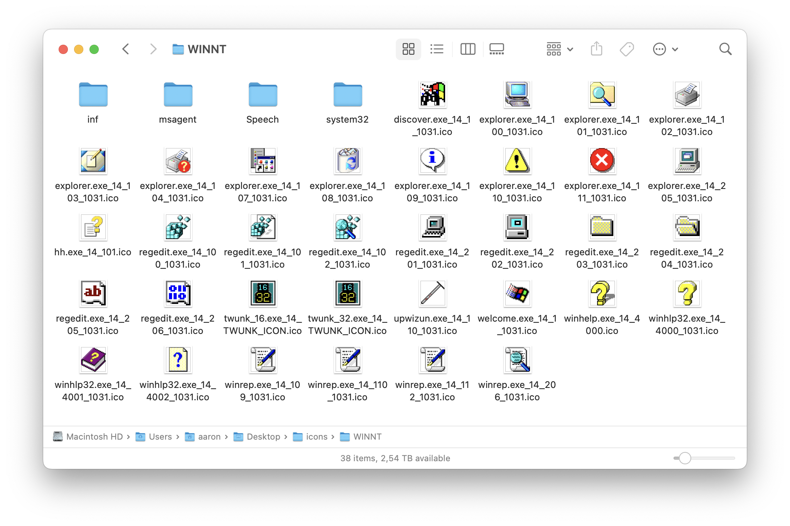

A wrapper around `wrestool` to recursively iterate over a directory and extract icons from any `.exe`, `.dll`, or `.cpl` file.

## Prerequisites

* Python >= 3.5
* [icoutils](https://www.nongnu.org/icoutils/)

## Usage

```
./icon-extractor.py SOURCE_DIR TARGET_URL
```

## Example

```
$ ./icon-extractor.py /Volumes/Windows ~/Desktop/icons
```

Result:


